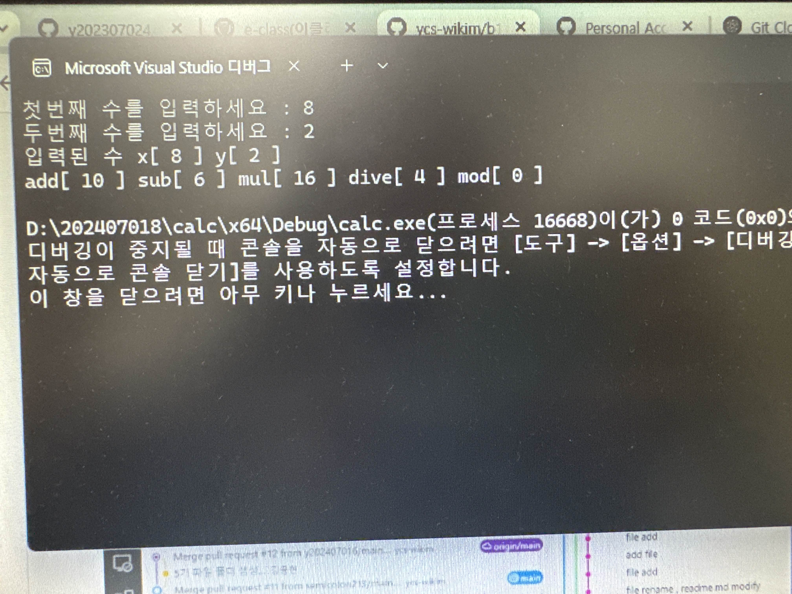

# b1_calc
=====================================
오픈소스 소프트웨어 기말고사 1번문제 
https://github.com/y202307024/2025oss
=====================================
## calc
=====================================
### oss기말프로젝트
=====================================
|팀원(역학)|업무|
|-----|
|김지민(팀장 - 202307024)|calc.cpp 파일 수정/브렌치병합| 
|이하나(팀원 - 202307028)|add.cpp, sub.cpp 파일 수정| 
|안현성(팀원 - 202237025)|dive.cpp 파일수정| 
|서윤아(팀원 - 202407018)|mod.cpp,mul.cpp|
====================================
# 문제해결 방법과 순서
1.main 브렌치와 dev/a 브렌치 병합 
2.main 브렌치와 dev/a에 add.cpp 파일 충돌 
3.충돌 발생한 dev/a에 add.cpp 파일수정하여 완료 

# 중간과정 스크린샷 
 

====================================
## git flow: 결과하면  

====================================
## 실행화면

